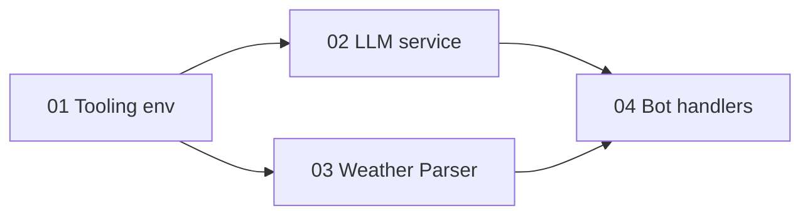

# Vox-Logis Lexmechanic — Plan overview

## Goal

Ship a new Telegram bot **“Vox-Logis Lexmechanic”** (Node.js, TypeScript, grammY) that:

- Answers **`/weather [city]`** using OpenWeatherMap (via **axios**) and returns replies styled as a **Lexmechanicus Tech-Priest** (Warhammer 40k).
- When a message contains a **URL**, fetches the page (**cheerio**), summarizes it with **OpenAI**, and replies in **Russian** as Lexmechanicus with **MarkdownV2** (bold title, body as bullets inside a spoiler).
- Surfaces **errors** through the same persona layer (`wrapInPersona(..., 'error')` or equivalent).

The implementation **may replace or refactor** the existing grammY codebase (today: `src/main.ts`, `src/handlers/*`, `src/services/*`, `src/config.ts`, `src/ritual.ts`, etc.) in favor of the target layout and service names.

## Scope

**In scope**

- Dependencies and scripts per requirements (see [01 — Project tooling & environment](./01-project-tooling-and-env.md)).
- `tsconfig.json` with **`strict`: true** (already true in repo; keep/enforce during refactor).
- **`.env.example`** with `TELEGRAM_BOT_TOKEN`, `OPENWEATHER_API_KEY`, `OPENAI_API_KEY`.
- Layout: **`src/bot.ts`** (entry), **`src/handlers/`**, **`src/services/`** with:
  - `src/services/llm.service.ts`
  - `src/services/weather.service.ts`
  - `src/services/parser.service.ts`
- Handlers wired from `bot.ts`: `/weather`, URL-in-text flow, persona-wrapped errors.

**Out of scope** (unless explicitly added later)

- Webhook deployment, Docker, CI, i18n beyond Russian summaries, non-current weather APIs, rate limiting / caching layers, admin commands beyond what is needed to run the bot.

## Success criteria

- `npm run dev` runs the bot with hot reload per agreed stack ([01](./01-project-tooling-and-env.md)).
- `npm run build` and `npm run start` run compiled output.
- `/weather Москва` (or any city) returns a persona-styled message grounded in real API data.
- A message containing `https://…` triggers fetch → parse → LLM summary → MarkdownV2 reply with **bold title** and **spoiler** bullets.
- Failures (network, API, parse) produce user-visible **Lexmechanicus** error text, not raw stack traces.

## Subtasks (execution order)

1. [01 — Project tooling & environment](./01-project-tooling-and-env.md)
2. [02 — LLM persona service](./02-llm-persona-service.md)
3. [03 — Weather & parser services](./03-weather-and-parser-services.md)
4. [04 — Bot entry, handlers & MarkdownV2](./04-bot-entry-handlers-markdownv2.md)

**Parallelism:** After **01**, **02** and **03** are independent of each other and may be implemented in parallel by different workers; **04** requires **02** and **03** interfaces to be stable enough to import.

## Verification summary

| Check | How |
|--------|-----|
| Typecheck / build | `npm run build` |
| Runtime | `npm run dev`, exercise `/weather` and a URL in a private chat |
| MarkdownV2 | Confirm Telegram renders spoiler and bold without parse errors |
| Secrets | No tokens in repo; only `.env` + `.env.example` keys documented |

## Global risks & decisions

- **MarkdownV2 escaping:** User-facing text from LLM and from web titles must be escaped or constrained; malformed MarkdownV2 causes send failures.
- **OpenAI + long pages:** Summarization should truncate or cap input tokens; parser should return plain text bounds.
- **URL detection:** Avoid treating non-HTTP schemes as fetch targets; consider `message.entities` for `url` / `text_link` vs regex, and one URL per message vs first URL only — document the chosen rule in [04](./04-bot-entry-handlers-markdownv2.md).
- **Refactor vs greenfield:** Replacing `src/main.ts` with `src/bot.ts` implies updating `package.json` `start` script to `node dist/bot.js` and removing or redirecting dead code to avoid duplicate entries.

## Dependency sketch

